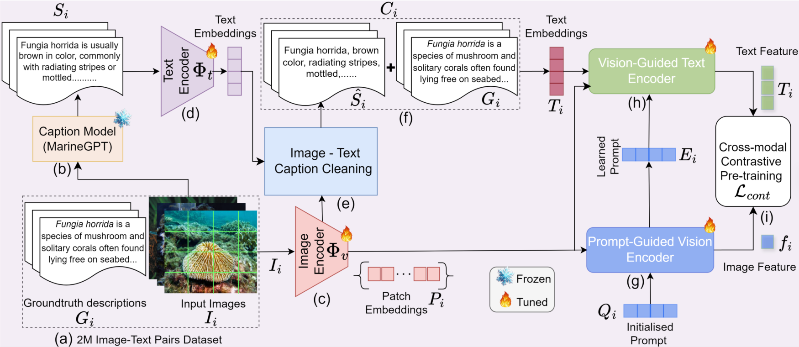

# AquaticCLIP: A Vision-Language Foundation Model for Underwater Scene Analysis




### Abstract
The preservation of aquatic biodiversity is critical in mitigating the effects of climate change. Aquatic scene understanding plays a pivotal role in aiding marine scientists in their decision-making processes. In this paper, we introduce AquaticCLIP, a novel contrastive language-image pre-training model tailored for aquatic scene understanding. AquaticCLIP presents a new unsupervised learning framework that aligns images and text in aquatic environments, enabling tasks such as segmentation, classification, detection, and object counting. By leveraging our large-scale underwater image-text paired dataset without the need for ground-truth annotations, our model enriches existing vision-language models in the aquatic domain. For this purpose, we construct a 2 million underwater image-text paired dataset using heterogeneous resources including YouTube, Netflix, NatGeo, etc. To fine-tune AquaticCLIP, we propose a prompt-guided vision encoder that progressively aggregates patch features via learnable prompts, while a vision-guided mechanism enhances the language encoder by incorporating visual context. The model is optimized through a contrastive pre-training loss to align visual and textual modalities. AquaticCLIP achieves notable performance improvements in zero-shot settings across multiple underwater computer vision tasks, outperforming existing methods in both robustness and interpretability. Our model sets a new benchmark for vision-language applications in underwater environments. 

## Environment Setup 

This setup is tested only on Linux.

1. Clone this repository and navigate to AquaticCLIP

```
git clone https://github.com/BasitAlawode/AquaticCLIP.git AquaticCLIP
cd AquaticCLIP
```

2. Create environment and install dependencies

```
conda env create -f environment.yml
conda activate aquaticclip
```

## Text Generation with MarineGPT

3. Download the Vicuna-7b model weights from [here](https://huggingface.co/Vision-CAIR/vicuna-7b/tree/main) and put them in side the vicuna-7b folder. NOTE: all files (8 in total) 
in this link should be downloaded.

4. Download MarineGPTVicuna 7B stage 2 model from [here](https://www.dropbox.com/scl/fi/8uimfr9vjk8sa6yyvvnbk/marinegpt_vicuna_7B_stage2_ckpt.pth?rlkey=4cwn4cmgi8gjnqfyds2aqnw8s&e=1&dl=0) and put it inside the marinegpt_weight folder. NOTE: This weights are obtained from marinegpt repository.

5. Run the below file to generate captions for our sample images (located in the test_images folder). Generated captions will be located in the same folder.

```
python generate_captions_for_imgs.py
```


## Acknowledgement
 - A part of our work is based on [MarineGPT](https://github.com/hkust-vgd/MarineGPT).

